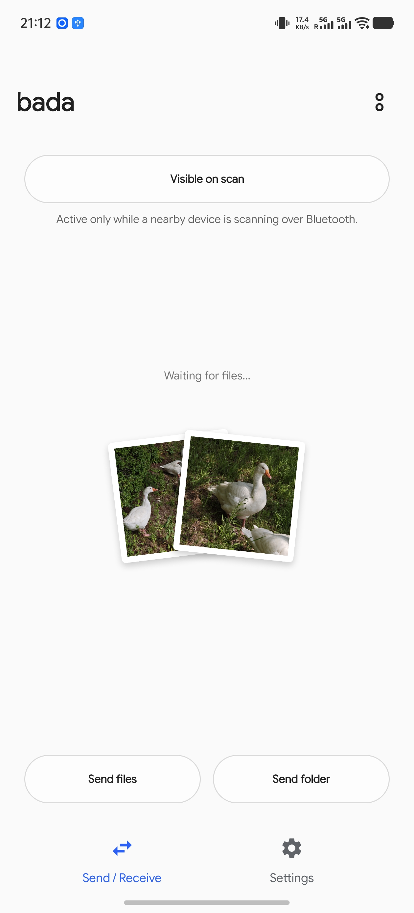
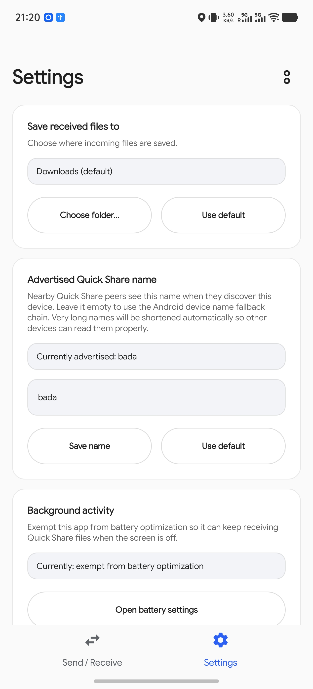

# Bada

Bada is an Android app for sending and receiving files with **Quick
Share / Nearby Share** peers without using Google Play Services for the
protocol implementation.

It targets interop with stock Android Quick Share, NearDrop on macOS, and
Quick Share on Windows. AirDrop, AWDL, iPhone discovery, and Apple-side
interop are out of scope.




## What It Does

- Receives files from nearby stock Quick Share senders over same-LAN shared
  Wi-Fi and Wi-Fi Direct paths, then saves them to Downloads or to a folder you
  choose in the app.
- Sends files from Android's system share sheet to stock Quick Share peers over
  same-LAN shared Wi-Fi and Wi-Fi Direct paths.
- Sends folders from the app's **Send folder** button while preserving the
  folder layout on the receiver.
- Shows the same 4-digit confirmation PIN flow users expect from Quick Share.
- Lets you choose the advertised Quick Share device name shown to senders.

Bada is still an early project. Current builds support both same-LAN shared Wi-Fi mode and
Wi-Fi Direct mode when sending files to or receiving files from stock Android
Quick Share devices.

## Install

Bada supports Android 7.0 or newer (`minSdk = 24`).

### Download a pre-built APK

End users can install the signed release APK from the
[GitHub Releases page](https://github.com/kyujin-cho/LibreDrop/releases).

1. Open the latest release and download the `.apk` asset.
2. If Android prompts for it, allow your browser or file manager to install
   apps from unknown sources. Google's Android help page for
   [downloading apps from other sources](https://support.google.com/android/answer/9457058?hl=en)
   covers the stock flow.
3. Open the downloaded APK and confirm the install prompt.

### Build from source

Contributors and developers can build and sideload the debug APK:

```bash
./gradlew :app:assembleDebug
adb install -r app/build/outputs/apk/debug/app-debug.apk
```

Requirements:

- JDK 17 and an Android SDK.
- Wi-Fi and Bluetooth enabled for the best interop coverage.

The debug package id is `dev.bluehouse.bada.debug`; release builds use
`dev.bluehouse.bada`.

## Use It

### Receive

1. Open Bada and grant the requested permissions.
2. Leave the receiver service running. The persistent notification shows the
   Wi-Fi network Bada is receiving on.
3. Use **Always visible** when you want other devices to see this phone even
   when no sender pulse is active.
4. Keep the default save location, or choose another folder from **Save
   received files to**.
5. When a sender starts a transfer, compare the PIN and tap **Accept**.

Received files are written to the selected folder. The default is the system
Downloads folder.

### Send

1. Share a file from any Android app and choose **Send via Quick Share**.
2. Wait for a nearby peer row to appear.
3. Tap the peer, compare the PIN, and complete the transfer.

To send a whole folder, open Bada and tap **Send folder**.

## Compatibility

| Peer | Current expectation |
| --- | --- |
| Stock Android Quick Share on Pixel / GMS devices | Supported for both sending and receiving in same-LAN shared Wi-Fi mode and Wi-Fi Direct mode, where the devices do not need to be on the same Wi-Fi network. BLE-assisted discovery/bootstrap is covered by the stock Android runbook. |
| Stock Samsung Quick Share / One UI | Supported for both sending and receiving in same-LAN shared Wi-Fi mode and Wi-Fi Direct mode, where the devices do not need to be on the same Wi-Fi network. Recent testing also validated BLE GATT bootstrap into a Galaxy S26 Ultra and Z Fold 7; read the Samsung note below before interpreting noisy GATT logs. |
| NearDrop on macOS | Not tested |
| Quick Share on Windows | Not tested |

Networking notes:

- Same-LAN shared Wi-Fi mode means the same SSID/VLAN with mDNS multicast
  allowed.
- Wi-Fi Direct mode covers the off-LAN Quick Share path: both devices do not
  have to be connected to the same Wi-Fi network, because they use nearby
  discovery/bootstrap and then transfer over a direct Wi-Fi link.
- Guest Wi-Fi, client isolation, routed VLANs, or enterprise multicast
  filtering can make peers disappear.
- Bluetooth Classic/RFCOMM is intentionally not exposed in user-facing flows.

## Permissions

Bada asks for permissions tied to receiving, discovery, and transfer
visibility, plus one for its own update flow:

- **Nearby Wi-Fi devices**: discovers and advertises Quick Share peers on the
  local network.
- **Bluetooth advertise / scan**: sends and listens for BLE pulses used by
  nearby Quick Share discovery.
- **Bluetooth connect**: opens BLE direct links and reads Bluetooth adapter
  state needed by nearby discovery.
- **Notifications**: shows the foreground receiver, incoming consent prompts,
  and transfer progress.
- **Location on older Android versions**: Android 11 and lower route BLE scan
  results and some Wi-Fi APIs through location permissions. Bada does not
  use physical location.
- **Battery optimization exemption**: optional, but useful on OEM builds that
  aggressively stop background foreground services.
- **Install unknown apps** (`REQUEST_INSTALL_PACKAGES`): lets the in-app
  self-update install a newer Bada APK downloaded from GitHub releases; the
  system still shows its own confirm dialog, and the grant is opt-in.

Bada also polls GitHub releases every 6 hours in the background to notify you
of new versions; this can be turned off with the **Automatic update check**
toggle in Settings.

## Troubleshooting

- If no peers appear, first put both devices on the same Wi-Fi network and
  disable guest/client isolation.
- If a stock Android sender cannot see Bada, open Bada and enable
  **Always visible**.
- If Samsung logs show `No handler registered`, check whether the sender or
  receiver UI is still progressing before treating it as a failure.
- If installs stall on vivo / OriginOS / Funtouch OS, the vendor security
  prompt may be waiting for manual approval.
- If received files are missing, check the selected save folder and whether the
  transfer reached **Completed**.

## Project Docs

- [Architecture](docs/architecture.md): the contributor/protocol README that
  used to live here, preserved verbatim.
- [Stock Android interop runbook](docs/testing/interop-stock-quick-share-android.md)
- [NearDrop macOS interop runbook](docs/testing/interop-neardrop-macos.md)
- [Release builds](docs/release.md)
- [Research notes](docs/research/)
- [Agent/contributor guidance](AGENTS.md)

## Build And Test

```bash
./gradlew :app:assembleDebug
./gradlew :core-protocol:test
./gradlew staticAnalysis
./gradlew check
```

The core protocol module is pure Kotlin/JVM and intentionally has no
`android.*` imports; Android-specific discovery, services, and UI live in
separate modules. See [Architecture](docs/architecture.md) for the module map
and protocol reading guide.

## Reference Material

- Protocol spec: <https://github.com/grishka/NearDrop/blob/master/PROTOCOL.md>
- NearDrop source: <https://github.com/grishka/NearDrop>
- Google's UKEY2 handshake spec: <https://github.com/google/ukey2>
